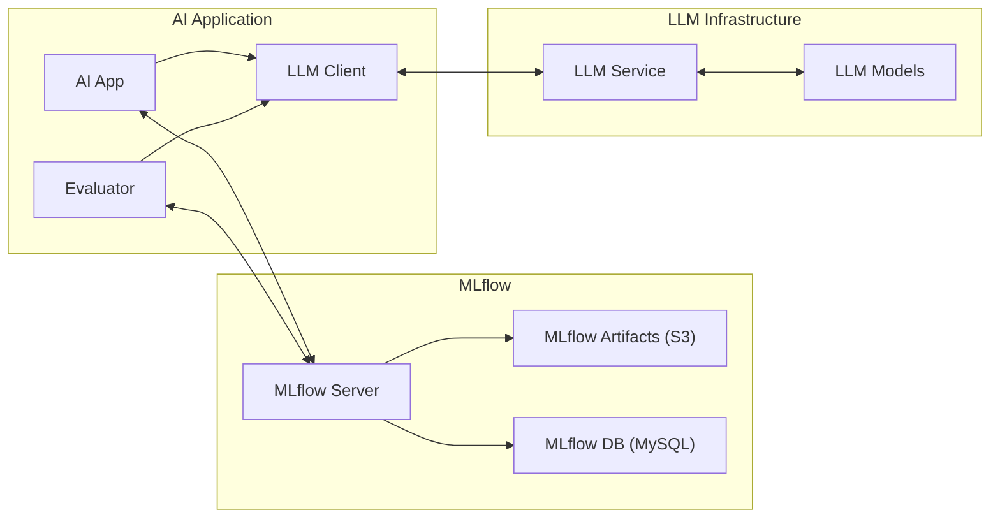
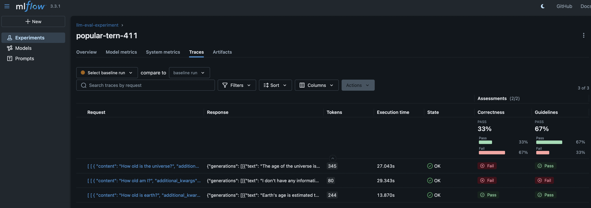

# Agent and LLM Evaluation with MLFlow
This project contains code and resources for evaluating large language models (LLMs) using MLFlow. The project aims to streamline the process of benchmarking and assessing the performance of various LLMs and agents.

## Features
- Integration with MLFlow for experiment tracking and model management.
- Predefined evaluation metrics for LLMs.
- Local LLM usage examples with Ollama.

**Evaluation System Diagram**




## Getting Started

### Prerequisites
- Install task from https://taskfile.dev/docs/installation
- Install uv from https://docs.astral.sh/uv/getting-started/installation/

### Setup
1. Clone the repository:
   ```bash
   git clone https://github.com/esumitra/example-mlflow-eval.git
    ```
2. Navigate to the project directory:
   ```bash
   cd example-mlflow-eval
   ```
3. Install the required dependencies:
   ```bash
   uv sync
   ```
4. Copy the environment variables template and update variables as needed:
   ```bash
   cp .env.template .env
   ```
5. Start the required services:
   ```bash
   task start_services
   ```
6. Download a local model (e.g., llama3.2:1b)
   ```bash
   task add_model -- llama3.2:1b
   ```
7. Create an S3 bucket for MLflow artifacts (if not already created).
   Open your [S3 management console](http://localhost:9000) and create a new bucket named `mlartifacts`.

### Run the sandbox
To ask questions in the sandbox, use the following command:
```bash
task ask -- <your question>
```

### Run an evaluation
To run an evaluation use the following command:
```bash
task eval
```

Review the results at http://localhost:5000. A sample screenshot is shown below:


## References
- [MLflow Documentation](https://mlflow.org/docs/latest/genai/eval-monitor/)
- [Ragas LLM Evaluation Metrics](https://docs.ragas.io/en/stable/concepts/metrics/available_metrics/) 
- [Ollama Models](https://ollama.com/search)

